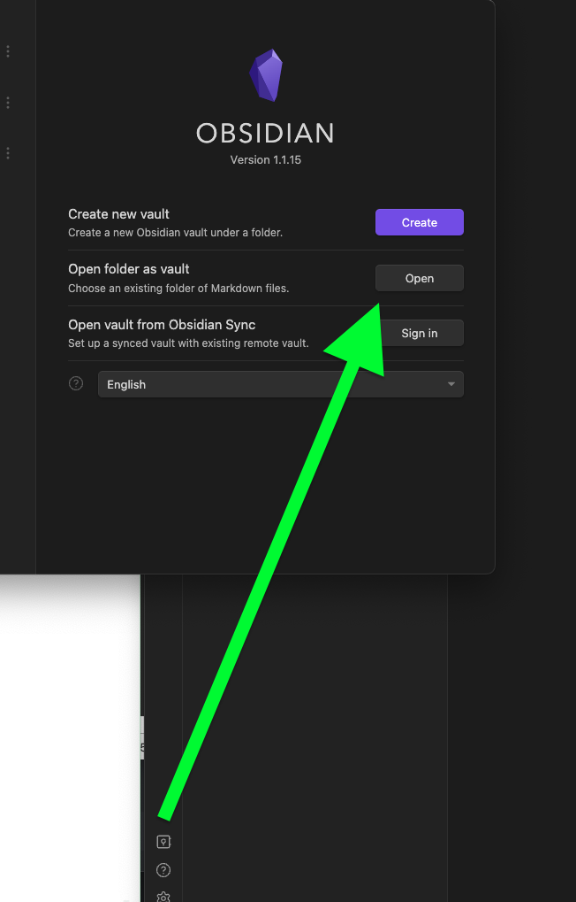

# Obsidian Starter

Starter that help to start with your fresh noting journey in couple of minutes.

## How to Start

1. Install obsidian.md 
2. Clone this repository wherever you want
3. Open cloned directory as new obsidian vault  
   
4. Remove `.git` direcory
5. Play and Have fun with your notes

## Plugins

### Core Plugins

1. Backlinks
2. Canvas
3. Command palette
4. File Recovery
5. Files
6. Graph view
7. Note composer
8. Outgoing Links
9. Outline
10. Page preview
11. Quick switcher
12. Search
13. Slash commands
14. Starred
15. Tags
16. Templates
17. Word count

### Community Plugins

1. Linter - Helps to keep clean notes
2. Advanced Slides - Helps navigating and composing tables
3. cMenu - Small bar with usefull buttons
4. Dataview - Query language thats helps to list and visualise taks
5. Excalidraw - Plugin to that allows use https://excalidraw.com/ in obsidian
6. Folder Note - CTRL + Click on Directory to create dir note
7. Hider - Hide GUI elements
8. Icon Folder - Setup icon for any folder in the vault
9. Icon Shortcodes - add emojis like on slack 😃
10. Kanban - just kanban boards
11. Markdown prettifier - Another plugin that helps to keep you notes clean
12. Natural Language Dates - add dates to your notes in easy way ! Type `@Today` and see how it works.
13. obsidian markmind
14. Outliner
15. Periodic Notes - Daily and weekly notes
16. Quick Switcher++ - Extended quick switcher
17. ReadItLater - Save some URLS and articles to read them later
18. Style Settings - more options to modify obsidian GUI
19. Table of Contents - adds table of contents to your notes
20. Tasks - 
21. Templater - Extended and more usefull templates for obsidian

## Configured Templates

### Templater Pluign

1. Common T
2. Daily T
3. Meet Inline T
4. Meeting Note T
5. Metadata T
6. MindMap T
7. Task T
8. Weekly Template
